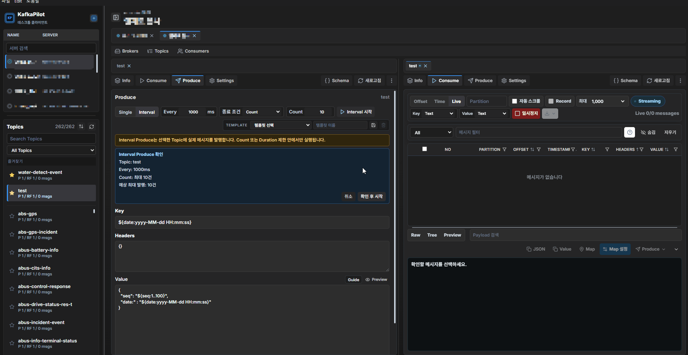
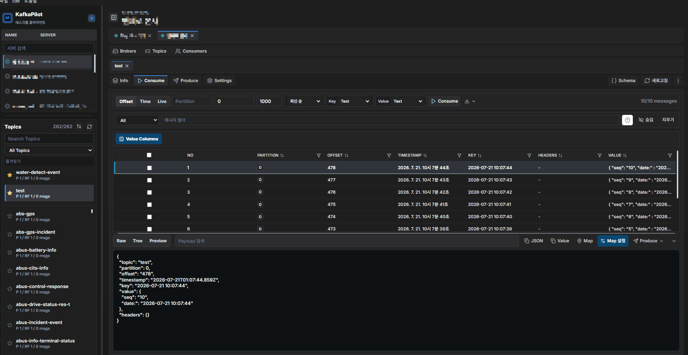
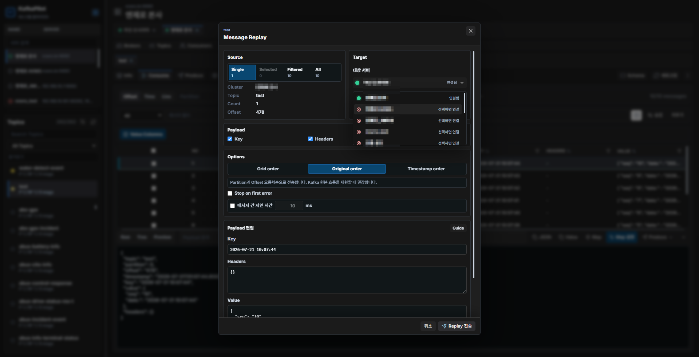

<div align="center">

# KafkaPilot

**Desktop Kafka client. Install and run — no server required.**

Consume · Replay · Produce · Map Viewer · Consumer Group Management

[한국어](README.ko.md) &nbsp;·&nbsp; [Changelog](CHANGELOG.md) &nbsp;·&nbsp; [Docs](docs/)

 &nbsp; &nbsp; &nbsp;

[](https://www.paypal.com/ncp/payment/R6DBD3HSJ9TPE)

</div>

---

Web-based Kafka UIs like AKHQ, Kafka UI, and RedPanda Console are powerful — but they require Docker, a server, or a deployment pipeline before you can open a single topic. Offset Explorer skips the setup but leaves you with limited functionality.

KafkaPilot is a desktop app that installs like any other application and connects directly to your Kafka brokers. No server. No Docker. No configuration files to manage. Download, install, and start consuming.

---

## Who is this for?

**Developers** building Kafka-integrated applications — not cluster operators. If you write code that produces or consumes messages and need a reliable way to inspect, test, and debug your Kafka topics, KafkaPilot is built for you.

It's especially useful for teams working with **real-time location data** — autonomous vehicles, smart city, BIS, C-ITS — where a live map of coordinate streams can save hours of debugging before a web dashboard even exists.

---

## Why KafkaPilot?

| | KafkaPilot | AKHQ / Kafka UI / RedPanda | Offset Explorer |
|---|:---:|:---:|:---:|
| No server or Docker needed | ✅ | ❌ | ✅ |
| Free & open source | ✅ | ✅ | ❌ |
| Map Viewer | ✅ | ❌ | ❌ |
| Split Pane | ✅ | ❌ | ❌ |
| Value Columns | ✅ | ❌ | ❌ |
| Live Record to file | ✅ | ❌ | ❌ |

---

## Map Viewer


A dedicated window for Kafka topics that carry location data. Open it from any consumed message.

When your web dashboard isn't ready yet and you need to verify that coordinate data is flowing correctly, Map Viewer gives you a live visual in seconds — no extra setup required.

- Per-topic **field mapping** for custom JSON paths (latitude, longitude, heading, speed, vehicle ID)
- **Coordinate conversion**: WGS84 degree, WGS84 millisecond, Korea TM (EPSG:5186), UTM Zone 52N
- Vehicle markers with **heading-aware rotation** and smooth movement interpolation
- **Trails** showing recent movement history per vehicle
- **Follow mode** locks the camera to a selected vehicle; auto-fit and free-move also available
- Speed display in `km/h` or `m/s`

---

## Split Pane



Open two topics side by side with fully independent consume, produce, and consumer group state per pane. Compare request and response topics, monitor a dead-letter queue alongside your main topic, or produce test messages while watching the result in real time.

---

## Value Columns



Pin specific JSON paths — like `vehicleId`, `status`, or `latitude` — as dedicated columns in the consume grid. Add them directly from the Message Inspector tree. Selections persist per topic and are included in CSV exports.

---

## Consume

Three modes for every use case:

- **Offset** — read from a specific start offset with a configurable limit
- **Time** — query by timestamp range
- **Live** — stream from the latest offset in real time without pulling committed group offsets

Large queries paginate automatically beyond `10,000` messages. Key and Value can be viewed and exported as **Text, JSON, Hex, or Base64**.

**Live Record** writes messages to a `JSONL` file stream without buffering the full dataset in renderer memory — safe for high-throughput topics running over extended periods.

---

## Message Replay



Send consumed messages to another server and topic directly from the Message Viewer toolbar — no need to switch to the Produce tab.

- **Scope**: single message, selected rows, filtered results, or all loaded messages
- **Single replay**: edit the payload directly before sending
- **Batch replay**: override Value fields with Dynamic Field tokens (`${uuid}`, `${seq:1..100}`, `${date:...}`)
- **Background jobs**: large replays run with progress tracking, per-message delay control, and abort

Useful for reproducing production issues in a dev environment, or migrating messages between clusters.

---

## Produce

Single-message publishing and **Interval Produce** with Count or Duration limits. A confirmation summary is shown before any interval job starts.

Dynamic fields work in Key, Headers, and Value:

| Token | Output |
|---|---|
| `${seq}` | 1, 2, 3 … |
| `${seq:1..10}` | Sequential, wraps at 10 |
| `VMS${seq:1..100\|pad=7}` | `VMS0000001` … `VMS0000100` |
| `${random:1..100}` | Random integer in range |
| `${float:0..1\|fixed=2}` | Random decimal, fixed precision |
| `${choice:READY\|RUNNING\|ERROR}` | Randomly picks one value |
| `${timestamp}` | Epoch milliseconds |
| `${timestamp:s}` | Epoch seconds |
| `${date:yyyy-MM-dd HH:mm:ss}` | Formatted local date/time |
| `${now}` | ISO 8601 |
| `${uuid}` | Random UUID v4 |
| `\${uuid}` | Literal `${uuid}` (escaped) |

**Produce Preview** renders the full payload before send. Invalid syntax is shown inline and blocks interval jobs from starting. Per-topic templates are saved in preferences and travel with settings export/import.

---

## Consumer Groups

Group detail shows committed offsets, beginning and end offsets, and lag by topic and partition.

**Offset Reset** is available from any Group detail view with four target modes:

- `Earliest` · `Latest` · `Timestamp` · `Specific offset`

The reset flow requires three steps: select partitions → run preview (shows target offsets and diff per partition) → type `RESET` to confirm. Execution is blocked while the Consumer Group has active members.

---

## Server Profiles

Each profile stores broker addresses, optional SSL/TLS, optional SASL/OAUTHBEARER, and optional Schema Registry settings. The **Test** button verifies the Kafka Admin connection before saving.

---

## Keyboard Shortcuts

| Shortcut | Action |
|---|---|
| `Ctrl/Cmd+P` · `Ctrl/Cmd+K` | Open Quick Search |
| `Ctrl/Cmd+Right` | Move current topic to right pane |
| `Ctrl/Cmd+Left` | Move right-pane topic to left pane |
| `Ctrl/Cmd+1` / `2` | Focus left / right pane |
| `Ctrl/Cmd+W` | Close current topic tab |
| `Ctrl/Cmd+Shift+W` | Close split pane |

All shortcuts can be rebound in `Preferences > Editor > Shortcuts`.

---

## Build

**Windows**

```bash
npm ci
npm run release:win
```

**macOS** *(must run on a Mac)*

```bash
npm ci
npm run release:mac
```

---

## Security

> [!WARNING]
> Client secrets, Schema Registry credentials, and bearer tokens are stored in the local settings file. Treat exported settings files like credentials — do not commit them to version control.

---

## Documentation

- [Changelog](CHANGELOG.md)
- [Release guide](docs/release.md)
- [macOS internal install](docs/macos-install.md)
- [Consume filters](docs/consume-filters.md)
- [Avro](docs/avro.md)
- [Enhancement roadmap](docs/enhancement-roadmap.md)
- [Project structure](PROJECT_STRUCTURE.md)

---

## License

MIT — see [LICENSE](LICENSE) for details.

Copyright (c) 2026 PJHUN.
