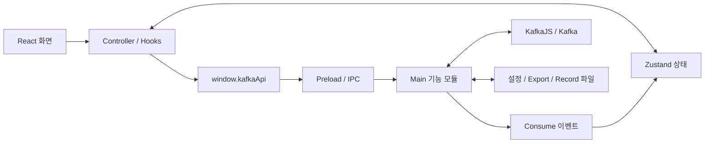

# KafkaPilot 소스 분석

- 날짜: 2026-09-25
- 저장소: https://github.com/pjhun0412/KafkaPilot
- 로컬 경로: `C:\workspace\KafkaPilot`
- 기준: `main`, `10d56e25e7c968adc64ee838a4c07e2e60de67fd` (2026-09-08), package version `2.0.7`
- 상태: 분석 완료. 아래 결함은 미수정.
- 검증: 기존 회귀 테스트 14개 통과, 전체 타입 검사 및 production build 성공.

## 전체 판단

KafkaPilot은 개발자가 Kafka 메시지를 조회·발행·재전송하고 좌표 스트림을 확인하는 데스크톱 워크벤치다. 별도 웹 서버를 배포하지 않고 Electron Main Process에서 Kafka에 직접 연결한다. Split Pane, Value Columns, Replay, 독립 Map Viewer가 주요 기능이다.

프로세스별 책임과 도메인별 상태 분리는 명확하다. 현재 빌드에는 Renderer와 Main/Preload의 타입 검사가 모두 포함된다. 다만 설정 복구, 대량 export, 실패 시 연결 정리에서 기존 테스트가 다루지 않는 결함을 확인했다. 기능 추가보다 이 경계 조건의 수정과 회귀 테스트가 우선이다.

## 구조와 읽기 순서

| 영역 | 책임 | 먼저 읽을 파일 |
|---|---|---|
| Main | 창·앱 수명주기, IPC 등록, Kafka·파일·업데이트 처리 | `src/main/main.ts`, `window.ts`, `kafkaClient.ts` |
| IPC | Broker/Topic/Group 조회·변경, Consume/Produce/Export | `src/main/ipc/consumeHandlers.ts`, `consumeProduce.ts` 및 기능별 모듈 |
| Preload | 기능별 메서드와 이벤트 구독을 Renderer에 공개 | `src/preload/preload.ts`, `liveMapPreload.ts` |
| Renderer | React UI, controller/hooks 조립, 상태·메시지 가공 | `src/renderer/App.tsx`, `hooks/app/controller/useWorkspaceAppController.ts` |
| State | 도메인 데이터와 화면 상태를 Zustand로 관리 | `src/renderer/stores/domain/`, `stores/ui/` |
| Shared | 프로세스 경계의 요청·응답·환경설정 타입 | `src/shared/types.ts` |
| Map Viewer | 독립 창, 좌표 변환, 차량 마커·이동 경로 표시 | `src/main/liveMapWindow.ts`, `src/renderer/map-viewer.ts`, `mapPreview.ts` |

기술 스택은 Electron, TypeScript, React 18, Zustand, KafkaJS, TanStack Table/Virtual, Leaflet, proj4, avsc다. Vite가 메인 UI와 Map Viewer 두 entry를 빌드하고 electron-builder가 설치 파일을 만든다.

추적된 `src` 파일은 338개다. 새 로컬 코드 그래프는 `C-workspace-KafkaPilot`로 인덱싱했다. 저장소 AGENTS.md의 `kafka-tool`은 이 PC의 현재 인덱스 이름과 다르다. 그래프는 일부 CSS를 부분 파싱했고 i18n 문자열도 Route로 분류하므로, Route 통계를 실제 HTTP API 수로 해석하지 않았다.

## 주요 실행 흐름

### Consume

`useConsumeActions` → preload → `consumeHandlers` → Offset/Time/Live 구현 → KafkaJS → `messageMapper` 순서다. Offset/Time은 요청 결과를 반환하고 Live는 `kafka:consume-message` 이벤트를 보낸다.

- Offset은 partition의 low/high와 조회 방향으로 범위를 계산한다. 요청 건수가 10,000을 넘으면 UI가 5,000건 단위로 페이지를 조회한다.
- Time은 timestamp별 시작 offset을 구한 뒤 시간 범위로 필터링한다.
- Live는 시작 시 partition별 offset을 캡처하고 이전 메시지를 걸러낸다.
- Live consumer key는 server/topic/consumerId를 포함한다. Renderer는 primary/split 상태와 이벤트 라우팅을 나누어 pane 간 이동을 처리한다.
- Live Record는 Main에서 JSONL을 순차 기록한다. 각 write 완료를 기다린 뒤 UI에도 메시지를 전달하므로, 파일 기록 기능이 Renderer 메시지 보관 자체를 없애는 것은 아니다.
- Live UI는 `maxMessages`로 건수를 제한하지만 메시지마다 배열을 복사한다. `messageMapper`는 큰 payload의 base64 보관만 생략하고 전체 UTF-8 문자열은 유지한다. 따라서 큰 메시지·다수 토픽의 메모리 사용량은 별도 부하 검증이 필요하다.

### Produce / Replay

`produceTemplate.ts`가 동적 필드를 검증·치환하고 `produceMessages.ts`가 Avro 인코딩과 Kafka 발행을 담당한다. 현재 발행 호출마다 producer를 생성·연결·해제한다. Replay는 메시지를 순차 발행하므로 대량 작업에서는 연결 비용을 포함한 처리량 측정이 필요하다.

`replayJobs.ts`의 background job은 Renderer 메모리 안에서 동작한다. 다이얼로그를 닫아도 작업은 이어지지만 앱 재시작 후 복구되는 영속 큐는 아니다. 중단 요청은 메시지 사이와 delay 중에 확인하며 이미 진행 중인 발행을 되돌리지 않는다.

### Avro / 인증 / 설정

- Confluent header의 schema ID로 Registry에서 schema를 조회·캐시하고, 실패하면 토픽별 manual schema를 시도한다. Produce는 등록된 manual schema로 인코딩한다.
- 현재 Kafka SASL 구현은 OAUTHBEARER의 client credentials 흐름이다. 범용 PLAIN/SCRAM 설정은 구현되어 있지 않다.
- Main과 지도 창은 `contextIsolation: true`, `nodeIntegration: false`를 사용한다.
- 서버 자격증명은 Electron `safeStorage`로 암호화한다. 기본 설정 export는 서버 secret을 제거하고, secret 포함 export는 비밀번호 기반 AES-256-GCM 암호화를 사용한다.
- Consumer Group Reset은 상태 확인 실패·그룹 정보 누락·활성 그룹을 차단한다. 기존 테스트에서 네 가지 정상 reset 모드와 실패 경로를 확인한다.

## 확인된 결함

아래 네 항목은 모두 미수정이다. 실제 소스 함수를 기존 `tests/load-typescript.cjs`로 실행하고 외부 의존을 mock으로 대체해 확인했다. 실제 Kafka나 사용자 설정 파일에는 접근하지 않았다.

### 1. 역순 대량 Export가 동일 메시지를 반복함 — P2

- 위치: `src/main/ipc/offsetMessageExport.ts:65`, `src/main/ipc/offsetWindow.ts:26`
- 조건: 역순 조회가 보존 최저 offset에 도달했고, 마지막 batch가 페이지 크기와 같으며 요청 건수가 더 남은 경우.
- 원인: 마지막 메시지의 offset을 다음 cursor로 사용한다. cursor가 low와 같아지면 `requestedEnd > low` 조건이 거짓이 되어 최신 high부터 다시 조회한다.
- 재현: low=0, high=5000, desc, limit=10000. 실제 범위 계산 함수와 export 반복문을 조합한 mock에서 출력 10,000행, 고유 offset 5,000개를 확인했다.
- 영향: CSV·JSON·로그 export에 중복 데이터가 포함될 수 있다.
- 수정 방향: 최초 최신 조회와 후속 cursor를 구분하고 최저 offset에 도달하면 종료한다.

### 2. 새 설치에서 설정 백업이 생성되지 않음 — P2

- 위치: `src/main/storage.ts:90`, `src/main/storage.ts:80`
- 원인: 저장 시 userData 디렉터리만 생성하고 `.recovery` 부모 디렉터리를 생성하지 않는다. 백업 rename의 ENOENT가 원본 부재와 같은 경로로 무시된다.
- 재현: 메모리 파일시스템에서 `writeProfiles`를 두 번 호출해도 `.recovery/servers.json`이 없었다.
- 영향: 저장은 성공해도 서버 프로필과 환경설정의 복구본이 남지 않는다.
- 수정 방향: 백업 디렉터리를 생성하고 ENOENT 발생 원인을 구분한다.

### 3. 원본 설정이 없으면 정상 백업도 사용하지 않음 — P2

- 위치: `src/main/storage.ts:334`, `src/main/storage.ts:373`
- 조건: `.recovery`가 존재하는 환경에서 원본을 백업으로 회전한 뒤 새 파일 배치 전에 종료되는 경우 등.
- 원인: 본 파일 읽기의 ENOENT에서 바로 빈 목록 또는 기본 설정을 반환한다.
- 재현: 정상 서버 백업만 남긴 mock에서 `readProfiles()`가 빈 배열을 반환했다. 환경설정도 동일한 조기 반환 구조다.
- 수정 방향: 원본 누락에도 백업을 확인하고 두 파일이 모두 없을 때만 초기값을 사용한다.

### 4. Offset/Time Consume의 구독 실패 시 연결 정리가 빠짐 — P2

- 위치: `src/main/ipc/offsetConsumerRunner.ts:35`, `src/main/ipc/timeRangeConsumerRunner.ts:37`
- 조건: consumer 연결 성공 후 topic 구독이 권한·메타데이터 오류 등으로 실패하는 경우.
- 원인: `connect`와 `subscribe`가 cleanup을 구성하는 Promise 바깥에 있다. 호출자의 finally는 임시 consumer group 삭제만 시도한다.
- 재현: 두 runner에 connect 성공/subscribe 실패 mock을 각각 주입했다. 오류는 전파되지만 `shutdownConsumer` 호출은 각각 0회였다.
- 영향: 앱에서 실패한 조회 연결을 명시적으로 해제하지 않는다. 실제 소켓 잔존 시간과 반복 실패 시 자원 사용량은 미측정이다.
- 수정 방향: 연결 시작부터 구독·실행·종료까지 하나의 cleanup 경계로 감싼다.

## 유지보수와 테스트 공백

`App.tsx`는 얇고 controller가 조립을 담당하지만 파라미터·callback 전달 계층이 많다. 최상위 controller 하나를 더 크게 만들기보다 변경할 기능의 action과 store를 먼저 찾는 방식이 적합하다.

현재 파일 길이는 MessageInspector 1,481행, Map Viewer 918행, ConsumePanel 684행, ProducePanel 549행이다. 특히 MessageInspector에는 Replay, 필드 선택, 지도 동작, payload 렌더링이 모여 있다. 관련 기능을 변경할 때 책임별로 점진 분리하는 편이 합리적이다.

기존 14개 회귀 테스트는 템플릿, Split callback 전달, Group Reset에 집중되어 있다. 저장 복구·Export 경계·Consume 수명주기·실제 UI 통합 검증은 다루지 않는다. `package.json`에 lint script는 없고 추적된 `.github` CI workflow도 없다. 기존 2026-09-06 분석에서 수정 완료된 문제는 이번 미해결 결함으로 다시 집계하지 않았다.

후속 작업 순서는 데이터 중복 방지 → 설정 백업/복구 → 연결 실패 정리 → 각 실패 경로 테스트 추가를 권장한다. 이후 실제 Kafka 통합 테스트와 대량 메시지 성능 검증을 진행할 수 있다.

## 검증과 작업 범위

| 항목 | 결과 |
|---|---|
| `npm ci --no-audit --no-fund` | 670개 설치 완료. 첫 시도는 npm cache 권한 오류, 권한 허용 후 성공 |
| `npm test` | 14 passed, 0 failed |
| `npm run build` | Renderer 타입 검사, Main/Preload 타입 검사·컴파일, Vite build 성공. 1,980 modules transformed |
| 추가 실패 경로 확인 | 리뷰어의 Export·백업 mock 재현 3건, 메인의 Offset/Time 구독 실패 재현 2건 성공 |
| 실제 Kafka 연결·Electron UI·설치 파일 | 미실시 |
| 의존성 취약점 감사·macOS 패키징 | 미실시 |

런타임 소스와 기존 테스트는 변경하지 않았다. 이번 작업에서는 이 분석 문서만 추가했다. 의존성과 빌드 결과는 기존 gitignore 대상이다. 저장소의 기존 문서 구조에 맞춰 이 보고서에 재발 조건·근거·후속 조치를 함께 기록했다.

## 후속 조사: 숫자형 Key 표시 정밀도 (2026-10-07)

- 상태: 원인 확인 후 로컬 소스 수정. 조사 기준 커밋은 `10d56e2`다.
- 증상: 다른 도구의 key `2522026100715025500`이 KafkaPilot 상세 JSON에서 `2522026100715025400`으로 표시된다.
- 원인: `src/renderer/utils.tsx:97`의 `key: parseJson(message.key)`가 문자열을 JavaScript Number로 변환한다. 이 값은 안전한 정수 범위(`9007199254740991`)를 넘으므로 정밀도를 잃는다.
- 경로: `messageMapper.ts`는 key를 UTF-8 문자열로 보존한다. `useConsumePanelMessages.ts`가 위 formatter로 상세 payload를 만든 뒤 JSON.stringify를 호출하면서 반올림된 숫자를 표시한다. 이 경로는 Kafka 원본을 수정하지 않는다.
- 검증: Node에서 `JSON.parse("2522026100715025500")`를 실행해 `2522026100715025400` 출력을 확인했고 `Number.isSafeInteger`는 false였다. 실제 클러스터 레코드는 직접 읽지 않았다.
- 임시 확인: Key 대상 Text 미리보기는 원문 문자열/원본 bytes를 사용한다.
- 수정 방향: 상세 payload의 key를 JSON 숫자로 자동 변환하지 않고 원문 문자열로 유지한다. 큰 정수·선행 0·JSON처럼 보이는 문자열 key에 대한 회귀 검증을 추가한다.

### 수정 내용과 지도 정수 좌표 지원

- `utils.tsx`의 상세 payload는 `key: message.key`를 사용한다. Kafka 수신, 상세 표시, Text 미리보기, JSON export에서 key가 같은 문자열로 유지되는 것을 회귀 테스트로 확인했다. Value JSON 해석은 유지한다.
- 지도 설정에 `wgs84_e6` 선택지를 추가했다. 사용자가 이 형식을 선택하면 Y/Lat와 X/Lng를 각각 1,000,000으로 나눈다. `currentLat=37757309`, `currentLng=128905820`은 `37.757309, 128.905820`이 된다.
- 숫자의 자릿수로 형식을 추정하지 않는다. 기존 `wgs84_msec`는 3,600,000으로 나누는 별도 형식으로 유지한다. 공유 타입과 설정 정규화에 새 형식을 반영해 토픽별 저장·복원도 지원한다.
- 독립 리뷰에서 실시간 지도 경로가 `message.value` 내부만 전달해 설정 화면의 `value.*` 필드 경로와 맞지 않는 문제를 발견했다. `ConsumePanel`의 실시간 경로에도 상세 메시지와 같은 payload를 전달하도록 수정했다. 기존 자동 좌표 탐색 fallback은 유지한다.
- `tests/key-map-regressions.test.cjs`에 7개 테스트를 추가했다. Key 원문, 음수·0·경계 좌표, 잘못된 좌표 거부, 설정 저장·복원, 기존 WGS84/Msec/TM/UTM 변환을 확인했다. 실제 ConsumePanel 효과를 실행하는 테스트에서 선택하지 않은 실시간 메시지의 E6 좌표 송신도 확인했다. 이 테스트는 수정 전 송신 0건으로 실패했고 수정 후 통과했다. React hooks·타이머·하위 화면은 mock을 사용한다. 기존 테스트를 포함한 `npm test` 결과는 21 passed다.
- 실제 Kafka 연결 및 Electron UI 통합 시험과 설치본 배포는 수행하지 않았다. 앞선 9월 분석의 Export·백업·Consumer 정리 결함 4건은 이번 변경 범위에 포함하지 않았다.
- 최종 검증: `npm test` 21개 통과, `npm run build`의 Renderer/Main/Preload 타입 검사와 Vite production build 통과, `git diff --check` 통과. 실시간 매핑 보완 후 독립 코드 리뷰에서 추가 결함은 발견되지 않았다.
