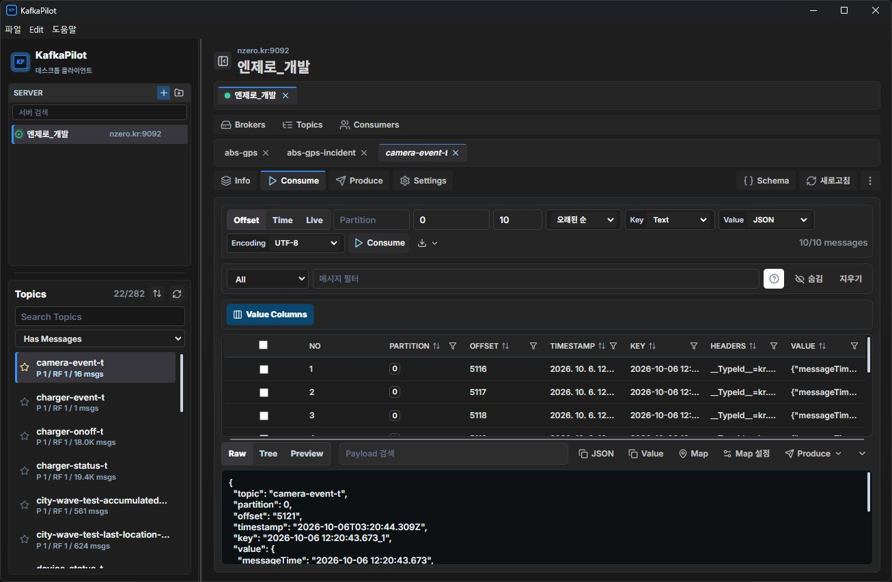
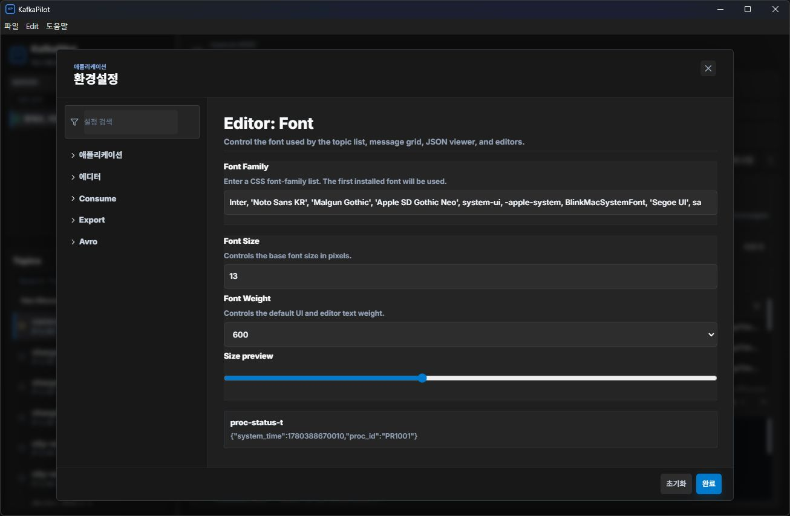

# KafkaPilot 전체 코드 및 UI/UX 점검

- 날짜: 2026-10-08 (Asia/Seoul)
- 기준: `main`, `52a8b358c727151242c13415314c6213f1745e56`, package `2.0.8` 및 현재 미커밋 변경
- 상태: 최초 감사에서 신규 12건·기존 4건을 확인. 2026-10-08 후속 작업에서 16건의 수정·회귀 검증·독립 리뷰를 완료했다. 현재 결과와 한계는 [후속 수정 기록](incidents/2026-10-08-audit-fixes.md)을 참조한다.
- 담당: Main/Preload, Renderer 상태·비동기 처리, UI·설정·Map을 독립 코드 리뷰 에이전트 3개로 분담하고 메인이 근거·빌드·실화면을 확인
- 최초 감사 범위: 이 보고서와 화면 증거만 추가. 아래 원인·재현은 수정 전 상태의 기록이며 후속 수정과 구분한다. 실제 사용자 설정·Kafka 데이터는 변경하지 않았다.

## 판단과 검증 범위

기본 화면 구성과 프로세스 분리는 유지되고 테스트·타입 검사·빌드도 통과한다. 그러나 운영 설정을 의도치 않게 바꾸는 경로, 중지한 전송의 재실행, 소비 세션과 화면 상태의 불일치가 있어 문제가 없는 상태로 판단할 수 없다. 외관 조정보다 데이터 변경과 비동기 수명주기 문제를 먼저 해결해야 한다.

분류는 P1 2건, P2 14건이다. P1은 운영 설정이나 발행 데이터에 직접 영향을 주므로 우선 수정해야 하는 항목이다. P2도 데이터 누락·중복, 백업 부재, 화면 오표시 등의 실제 영향이 있어 후속 수정이 필요하다. 발견 수는 모든 코드 경로가 완전히 검증됐다는 의미가 아니다.

그래프는 이 PC의 `C-workspace-KafkaPilot`, 루트 `C:/workspace/KafkaPilot`을 사용했다. 문서에 남은 `kafka-tool`과 이름이 다르다. 일부 CSS는 부분 파싱되어 실제 파일을 확인했다. 과거 기억은 현재 소스 및 [이전 보고서](codebase-analysis-2026-09-25.md)와 대조했다.

실행 중인 Electron 창에서 Consume와 환경설정 화면을 관찰했다. 이 창은 로컬 `dist/renderer/index.html`을 열고 있었으나 감사 중 새로 빌드한 파일을 다시 로드하지 않았다. 따라서 실화면 관찰은 실행 중인 앱의 해당 두 화면에 한정하며, 현재 소스 전체의 E2E 검증으로 간주하지 않는다.

## 우선 수정할 결함

### 1. P1 — 일부 Kafka 설정 변경이 나머지 설정을 초기화

- 위치: `src/main/ipc/topicConfigs.ts:44-49`, `src/main/ipc/brokerConfigs.ts:48-53`.
- 조건: 토픽에 여러 사용자 설정이 있는 상태에서 Settings에서 한 항목만 저장하거나, Broker 설정 하나를 수정한다.
- 원인: UI는 변경 항목만 보내지만 Main은 전체 설정 대체 API인 `alterConfigs`에 그대로 전달한다.
- 영향: 예를 들어 `cleanup.policy=compact` 토픽에서 retention만 수정하면 cleanup override가 사라져 broker 기본 정책을 상속할 수 있다. 기본값이 `delete`라면 보존 동작이 의도와 달라진다. 다른 broker 동적 설정도 같은 원인으로 영향을 받는다.
- 검증: 실제 함수의 요청 fixture에서 변경한 retention 항목만 전송됨을 확인. 설치된 KafkaJS 구현과 Apache API 계약을 대조했다. 실제 클러스터 설정은 변경하지 않았다.
- 수정 방향: 증분 설정 변경 API를 사용한다. 전체 설정을 조회해 병합하는 대안은 민감 설정 조회 불가와 동시 수정 문제까지 고려해야 한다.
- 외부 근거: [Apache KIP-339](https://cwiki.apache.org/confluence/spaces/KAFKA/pages/87298616/KIP-339+Create+a+new+IncrementalAlterConfigs+API), [Apache Admin API](https://kafka.apache.org/37/javadoc/org/apache/kafka/clients/admin/Admin.html).

### 2. P1 — 반복 Produce를 재시작하면 중지한 작업도 다시 전송

- 위치: `src/renderer/components/workspace/WorkspacePaneContent.tsx:143-176`.
- 조건: Interval Produce 실행 → 전송 사이 대기 중 Stop → 기존 대기가 끝나기 전에 새 Start.
- 원인: 실행별 식별자 없이 같은 토픽의 boolean 실행 플래그를 재사용한다. 새 실행이 플래그를 true로 바꾸면 이전 루프도 다시 진행한다.
- 영향: 이전 payload가 추가 발행되고, 먼저 종료한 이전 루프가 새 실행을 중단하거나 전송 횟수를 덮을 수 있다.
- 검증: 실제 컴포넌트 함수와 제어 가능한 타이머 fixture에서 `old, new` 전송 후 이전 타이머를 실행하자 `old, new, old`가 됐다. 실제 Kafka 전송은 하지 않았다.
- 수정 방향: 실행별 토큰 또는 AbortController를 도입하고 전송·상태 갱신·종료 시 자신이 현재 실행인지 확인한다.

## 소비·조회·검색 결함

### 3. P2 — 독립적인 Offset/Time 조회가 같은 Consumer Group을 공유

- 위치: `src/main/ipc/consumeOffset.ts:17`, `src/main/ipc/consumeTimeRange.ts:19`.
- 조건: 두 pane에서 같은 토픽·파티션을 동시에 조회하거나 Export와 조회가 겹친다.
- 원인: Group ID에 서버·토픽·파티션만 사용하고 요청별 고유 ID가 없다.
- 영향: 독립 조회가 파티션을 나눠 배정받아 한 요청이 빈 결과 또는 불완전한 결과로 끝날 수 있다.
- 검증: 같은 입력의 ID 일치 및 설치된 KafkaJS round-robin assigner의 단일 파티션 배정을 확인. 실제 Kafka 동시 조회는 미실시.
- 수정 방향: 일회성 요청별 고유 Group ID를 발급하고 해당 요청의 그룹만 정리한다.

### 4. P2 — Avro 디코딩 중 idle timeout으로 메시지 누락

- 위치: `src/main/ipc/offsetConsumerRunner.ts:75-82`, `src/main/ipc/timeRangeConsumerRunner.ts:74-88`.
- 조건: 두 번째 이후 메시지의 디코딩·Schema Registry 조회가 Offset 700ms 또는 Time 900ms 이상 지연된다.
- 원인: 메시지 처리 시작 시 idle timer를 설정하고 비동기 디코딩 완료를 기다린다. 타이머가 먼저 종료시키면 완료 이전 배열을 복사해 결과를 확정한다.
- 영향: 수신한 메시지가 조회·Export 결과에서 빠지고 정상적인 짧은 결과로 보일 수 있다.
- 검증: `[0,1]` 입력 중 두 번째 디코딩을 Offset 900ms, Time 1,100ms 지연한 두 fixture 모두 `[0]` 반환.
- 수정 방향: 처리 중인 메시지는 idle로 판정하지 않고 진행 중 디코딩을 반영한 뒤 완료한다.

### 5. P2 — Live pane 이동 후 재시작이 다른 pane의 소비를 중단

- 위치: `src/renderer/hooks/actions/useConsumeActions.ts:178-188`, `src/renderer/hooks/workspace/useLiveConsumeRouting.ts:55-61`, `src/main/ipc/consumeHandlers.ts:55-56`.
- 조건: primary Live 시작 → split으로 토픽 이동 → primary에 같은 토픽을 다시 열어 Live 시작.
- 원인: 이동한 consumer ID는 여전히 `primary`인데 새 실행도 같은 ID를 쓴다. Main은 같은 ID의 기존 consumer를 먼저 정지한다.
- 영향: split의 소비·녹화가 중단되지만 두 pane 모두 실행 중으로 표시되고 양쪽 Stop이 같은 consumer를 가리킨다.
- 검증: 실제 routing/actions fixture에서 UI 실행 목록은 두 개, backend 세션은 하나, 양쪽 Stop ID는 `primary`였다.
- 수정 방향: consumer identity를 pane identity와 분리한다.

### 6. P2 — 연결 대기 중 탭을 닫아도 Live·녹화가 뒤늦게 시작

- 위치: `src/renderer/hooks/workspace/usePrimaryTopicTabActions.ts:41-44`, `src/renderer/hooks/actions/useConsumeActions.ts:188-194`.
- 조건: Live 시작 요청이 지연되는 동안 해당 토픽 탭을 닫는다.
- 원인: 닫기는 이미 streaming으로 등록된 요청만 정지하며 진행 중인 시작 요청을 무효화하지 않는다.
- 영향: 탭과 Stop 버튼이 없는데 소비·파일 기록이 계속된다.
- 검증: 늦은 시작 응답을 완료한 fixture에서 `tabs=[]`, 선택 없음, `streaming=[primary:t]`, 기록 경로 유지, stop 호출 0회.
- 수정 방향: 시작 요청도 수명주기를 추적하고 닫힌 뒤 성공한 consumer는 즉시 정리한다.

### 7. P2 — 빠른 토픽 전환 시 이전 Info 응답이 현재 화면을 덮음

- 위치: `src/renderer/hooks/actions/useTopicResourceActions.ts:128-135`, `src/renderer/hooks/app/state/useWorkspaceDerivedState.ts`의 서버별 detail 선택 경로.
- 조건: 캐시 없는 A→B 선택에서 B 상세 응답이 먼저 도착한다.
- 원인: 응답 시 현재 선택을 확인하지 않고 서버별 단일 detail을 덮는다.
- 영향: 선택 탭은 B인데 상세 제목·파티션·메시지 수는 A가 된다.
- 검증: 실제 hook의 deferred promise를 B→A 순서로 완료해 selected=B, detail=A를 확인.
- 수정 방향: 토픽별 캐시에 응답을 저장하고 현재 선택과 일치할 때만 표시 상태에 반영한다. 직접 조회하는 navigation 경로도 함께 확인한다.

### 8. P2 — 정규식 필터의 역슬래시가 제거되어 잘못 매칭

- 위치: `src/renderer/messageFilters.ts:95-102`.
- 조건: `value:/^\d+$/`, `\w`, `\s`, `\.` 같은 정규식 escape를 입력한다.
- 원인: tokenizer가 정규식 내부에서도 역슬래시를 제거한다.
- 영향: 원하는 메시지가 누락되고 잘못된 메시지가 필터된다. 필터 결과로 Export·Replay할 때도 영향을 준다.
- 검증: 값 `123`, `ddd`, `abc`에 `value:/^\d+$/`를 적용한 실제 필터 fixture는 `ddd`만 반환했다.
- 수정 방향: 정규식 리터럴의 escape를 보존하도록 토큰화한다.

## 설정·Map UX 결함

### 9. P2 — Map Auto Fit이 자신의 줌 이벤트로 해제

- 위치: `src/renderer/map-viewer.ts:890-892`.
- 조건: 여러 좌표에서 Auto Fit을 실행하여 `fitBounds()`가 줌을 변경한다.
- 원인: 프로그램이 발생시킨 `zoomstart`도 사용자 조작으로 처리해 `free` 모드로 바꾼다.
- 영향: 이후 좌표부터 자동 화면 맞춤이 중단된다.
- 검증: 설치된 Leaflet의 실제 `fitBounds → setView → _resetView → _moveStart`와 앱 핸들러를 추출 실행해 `fit → free`를 재현. 독립 Map 창에서 실스트림 검증은 하지 않았다.
- 수정 방향: 사용자 줌 조작과 프로그램에 의한 프레이밍을 구분한다.

### 10. P2 — 설정 가져오기에서 언어·사이드바 접힘 누락

- 위치: `src/renderer/hooks/actions/settingsTransferUtils.ts:71-76`, `src/renderer/hooks/preferences/usePersistedPreferences.ts:201` 이후 저장 경로.
- 조건: 현재와 다른 `appearance.language`, `layout.sidebarCollapsed`를 가진 설정을 가져온다.
- 원인: 가져오기 setter 목록과 적용 함수에서 두 필드를 처리하지 않는다.
- 영향: 기존 화면 값이 유지되고 자동 저장이 가져온 값을 다시 덮는다.
- 검증: 실제 apply 함수에 `ko`, `sidebarCollapsed:true`를 전달해도 기존 `en`, `false`가 남는 fixture 확인.
- 수정 방향: 두 필드를 setter 타입·호출부·적용 함수에 연결한다.

### 11. P2 — 글꼴 초기화가 LOG 내보내기 양식을 삭제

- 위치: `src/renderer/components/modals/PreferencesDialog.tsx:178-181`.
- 조건: Editor: Font 페이지의 초기화 버튼을 누른다.
- 원인: 글꼴 초기화 콜백에 `onExportFormatTemplate(DEFAULT_EXPORT_FORMAT_TEMPLATE)`이 연결되어 있고 fontWeight 초기화는 없다.
- 영향: 관련 없는 사용자 LOG 양식이 사라지며 글꼴 굵기는 그대로 남는다.
- 검증: 실제 콜백 fixture에서 `CUSTOM {value}`가 기본값으로 바뀌고 굵기 900은 유지됐다. 사용자 설정 손실을 피하기 위해 실화면에서는 초기화 버튼을 누르지 않았다.
- 수정 방향: 이 버튼은 글꼴 속성만 초기화한다.

### 12. P2 — 지도 창을 열지 않아도 좌표 버퍼가 무제한 증가

- 위치: `src/main/liveMapWindow.ts:8-13`, `src/renderer/components/workspace/consume/ConsumePanel.tsx:267-285`, `src/renderer/mapPreview.ts:537-539`.
- 조건: Live 좌표 스트림에 key·차량 ID가 없거나 매번 다른 ID가 들어온다.
- 원인: UI가 지도 창의 열림 여부와 무관하게 좌표를 보내고, offset 포함 fallback ID를 전역 Map에 삭제·상한 없이 저장한다.
- 영향: 창을 사용하지 않아도 메시지 수에 비례해 Main 메모리가 계속 누적된다.
- 검증: 실제 모듈 fixture로 창 생성 없이 20,000개 좌표를 보낸 후 20,000개가 모두 유지됨을 확인. 장기 성능 저하·크래시 발생 시점은 미측정.
- 수정 방향: 용량·시간 기준 보관 정책 또는 지도 구독 수명주기를 정의한다.

## 기존 미해결 결함 재확인

다음 네 건은 [2026-09-25 보고서](codebase-analysis-2026-09-25.md)에 이미 기록되어 있으며 현재 코드로 다시 재현했다. 새로 발견한 결함 수에는 포함하지 않는다.

| 번호 | 우선순위·결함 | 현재 위치 | 이번 재현 결과 | 수정 방향 |
|---|---|---|---|---|
| 13 | P2 역순 Export가 최저 offset에서 최신으로 돌아가 중복 | `offsetMessageExport.ts:65-68`, `offsetWindow.ts:26` | low=0, high=5000, limit=10000에서 10,000행, 고유 offset 5,000개 | 최초 최신 조회와 후속 cursor 구분, low 도달 종료 |
| 14 | P2 새 설치에서 설정 백업 미생성 | `storage.ts:80-95` | 메모리 FS에서 서버를 두 번 저장해도 `.recovery` 없음 | 백업 부모 디렉터리 생성, ENOENT 원인 구분 |
| 15 | P2 원본 설정 누락 시 정상 백업 무시 | `storage.ts:336-337`, `375-376` | 정상 백업이 있어도 읽기 0회, 서버 빈 목록·기본 설정 반환 | 원본 ENOENT에서도 백업을 확인 |
| 16 | P2 Consume subscribe 실패 시 연결 정리 누락 | `offsetConsumerRunner.ts:35-36`, `timeRangeConsumerRunner.ts:37-38` | connect 성공·subscribe 실패 두 fixture에서 cleanup 각각 0회 | 연결부터 실행까지 하나의 정리 경계 적용 |

위 표의 경로는 13·16번이 `src/main/ipc/`, 14·15번이 `src/main/` 아래다.

## 실제 UI 관찰

### 1단계 — 기존 Consume 화면: 기본 구성 양호, 밀도·식별성 보완 후보

서버/토픽 선택, 작업 탭, 메시지 목록과 상세 영역의 계층은 구분된다. 1306×853 창에서 주요 버튼이 겹치거나 화면 전체가 깨진 현상은 관찰하지 못했다. 다만 현재 펼친 상세 영역 때문에 표에는 약 3행만 보이고 긴 시간·key·header·value가 많이 생략된다. 이는 사용자 조절값에 영향을 받으므로 확정 레이아웃 결함으로 세지 않았다. 선택한 메시지와 상세의 연결을 더 쉽게 식별할 수 있는지 추가 사용자 검증이 유용하다.

### 2단계 — 환경설정 열기: 배치 양호, 언어 일관성·키보드 검증 필요

설정 검색, 분류, 편집 폼, 초기화·완료 버튼은 보인다. 한국어 상태에서 제목·완료 버튼과 `Editor: Font`, 영어 설명문이 혼재한다. 용어로서 남긴 Kafka 고유명과 달리 일반 설명문 번역은 일관성을 개선할 여지가 있다. 이는 기능 결함 16건과 구분한 표현 개선 항목이다.

접근성 트리에서 `aria-modal` 대화상자와 배경 컨트롤이 함께 노출되며, 환경설정과 공통 단축키 코드에는 모달 focus trap과 배경 동작 차단이 확인되지 않았다. 도구가 보고한 focused element는 문서에 머물러 있어 실제 Tab 이동을 신뢰성 있게 추적하지 못했다. Escape 입력 뒤에도 설정이 보였으나 이 관찰만으로 모든 키보드 접근성 결함을 확정하지 않는다. 모달 진입 초점, Tab 순환, Esc 닫기, 종료 후 초점 복귀, 스크린리더를 별도 검증해야 한다.

실화면에서 서버 설정 저장·초기화·Produce·Offset Reset을 실행하지 않았다. 캡처는 감사 중 직접 본 창을 저장했으며 첫 캡처에서 다른 앱이 잡힌 이미지는 폐기했다. 색 대비·다양한 DPI·창 크기·macOS·Map 실스트림에 대한 완전한 UX/접근성 적합성을 주장하지 않는다.

## 검사 결과와 남은 한계

| 검사 | 결과 |
|---|---|
| 최초 `npm test` | 29개 통과 |
| 추가 변경 포함 최종 `npm test` | 34개 통과, 실패 0 |
| 최종 `npm run build` | Renderer와 Main/Preload 타입 검사·컴파일, Vite 빌드 통과; 1,984 모듈 |
| Vite 경고 | main JS 약 507.40 kB, 500 kB chunk 경고. 그 자체로 성능 장애가 확인된 것은 아님 |
| `git diff --check` | 통과 |
| 결함 재현 | 기존 TypeScript loader, 실제 함수·일부 실제 라이브러리 구현, 메모리 FS·consumer·timer·deferred promise fixture 사용 |
| Kafka 통합 | 실제 발행·설정 변경·동시 조회·지연 Registry 통합 시험 미실시 |
| UI | 실행 중인 Windows Electron Consume·환경설정 직접 관찰; 전체 흐름 E2E 미실시 |
| 기타 | 실제 장시간 부하, 설치/업그레이드, macOS, 외부 의존성 취약점 감사 미실시 |

첫 샌드박스 빌드는 Vite의 `realpath` 권한 오류로 실패했으나 허용된 환경에서 재실행해 통과했다. 이는 소스의 빌드 오류와 구분했다. 별솔의 기존 KafkaPilot dev 프로젝트 연결과 값 없는 실행 계획을 확인했으며 이 빌드는 주입할 비밀 설정이 없었다.

검토 도중 별도 작업에서 `ConsumePanel.tsx`, `useInspectorResize.ts`, 신규 `inspectorLayout.ts`와 리사이즈 테스트가 추가됐다. 이 감사에서 수행한 수정은 아니다. 변경은 보존하고 새 테스트를 포함해 검증을 한 번 갱신했다. 리뷰어가 추가 변경의 높이 계산, 창 크기 변경, 포인터 구분, 취소·캡처 상실·언마운트 정리와 테스트를 검토했으며 고확신 결함은 찾지 못했다. Map 좌표 전송 경로와 위 결함은 해당 리사이즈 변경과 독립적이다. 새 리사이즈 코드가 로드된 Electron UI 검증은 하지 않았다.

서버 그룹 추가·이동·정렬·검색·저장 연결에서는 이번 검토 범위 안에서 별도의 고확신 결함을 찾지 못했다. 기존 key 원문 보존, 좌표 E6 변환, 활성 Consumer Group reset 차단 회귀도 통과했다. 이는 모든 입력과 운영 환경에서의 무결함 보증이 아니다.

## 권장 작업 순서

1. 설정 변경 API와 반복 Produce 실행 식별자를 수정한다. 부작용을 검증하는 회귀 테스트를 먼저 추가한다.
2. 소비 요청 ID, pane 이동·닫기, 늦은 응답, Avro 디코딩 종료 조건을 함께 정리한다.
3. 역순 Export와 설정 백업/복구를 수정하여 데이터 신뢰성을 확보한다.
4. 정규식 필터, 설정 가져오기·초기화, Map 자동 맞춤·보관 상한을 수정한다.
5. 독립 테스트 Kafka 환경에서 동시 소비, 네트워크 지연, Registry 지연, 재연결·닫기·재시작을 통합 검증하고 키보드 접근성과 화면 크기별 UI를 확인한다.

이번 작업은 분석 요청 범위로 종료하며 소스 수정·커밋·릴리즈·배포는 수행하지 않았다.
